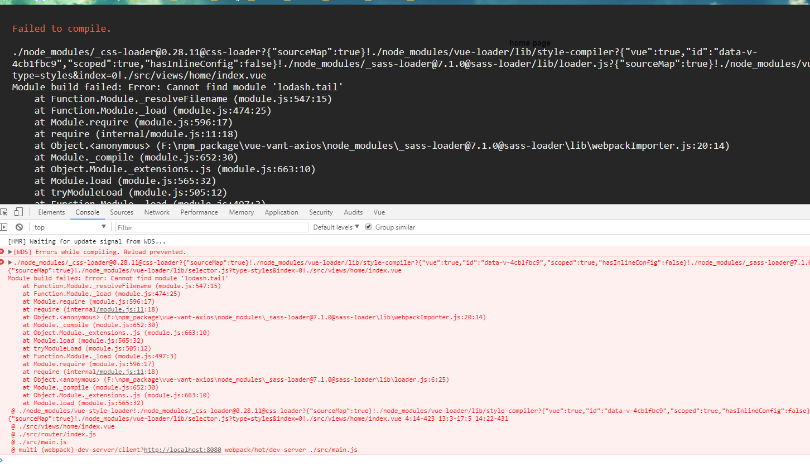
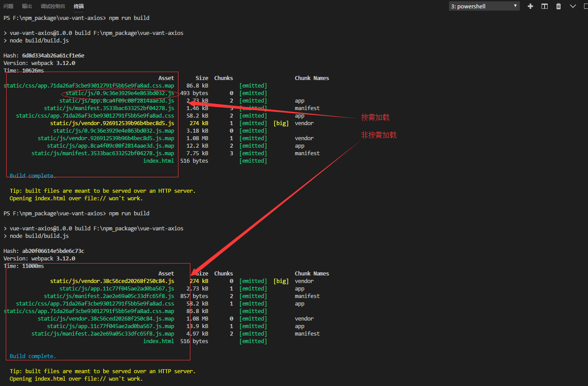

# vue-vant-axios

## 技术栈

* vue
* vue-router 路由
* vant ui库
* axios ajax库
* scss css预处理器

## 项目文件架构说明

```js
|vue-vant-axios
    |——src 源码文件
      |——assets 公共资源
      |——components 公共组件
      |——router 路由
      |——views 逻辑页面
          |——home 首页
            |——index.vue 模板
            |——styles.scss 样式 可选
            |——images 图片 可选
            |——swipe
              |——index.vue
              |——style.scss
              |——images
          |——mime 主页
            |——index.vue
            |——style.scss
            |——images
```

## v0.0.1

* 搭建vue-vant-axios项目，使用vue-template-webpack模板

## v1.0.0

* 安装插件 vant
```js
//src/main.js
  import Vant from 'vant';
  import 'vant/lib/vant-css/index.css';
  Vue.use(Vant);
```
* 引入移动端适配方案rem
```js
//src/main.js
import './assets/rem';//src/assets/rem.js
```
* 删除无用文件HolleWord.vue等
* 新增页面views/home views包含所有的逻辑页面
```js
|——src
  |——views
    |——home
      |——index.vue
      |——style.scss
```
* 使用css处理器scss

  安装依赖 style-loader css-loader sass-loader node-sass

  npm install  style-loader css-loader sass-loader node-sass --save-dev

  这里需要注意的是，有可能node-sass安装失败，这时候用淘宝的cnpm安装就能解决这个问题

  即

  cnpm install node-sass --save-dev

  如果报已下错误

  

  解决办法是，删除node_modules package-lock.json，并重新安装依赖

  npm install

* 路由按需加载
```js
//src/router/index.js
import Vue from 'vue';
import Router from 'vue-router';
import _import from './_import';//src/router/_import.js

Vue.use(Router);

export default new Router({
  routes: [
    {
      path: '/',
      name: 'Home',
      component: _import('home')
    }
  ]
});
```

结果对比



* babel-polyfill

1. 安装

   npm install babel-polyfill

2. 引入

```js
//build/webpack.base.conf.js
  entry: {
    app: ['babel-polyfill','./src/main.js'],
  },
```
